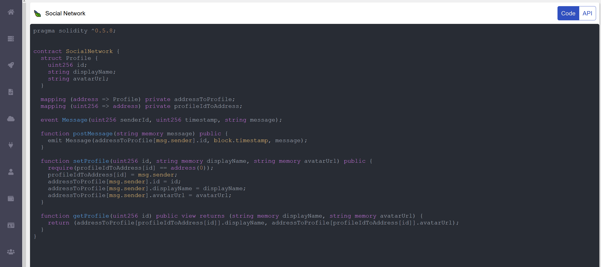
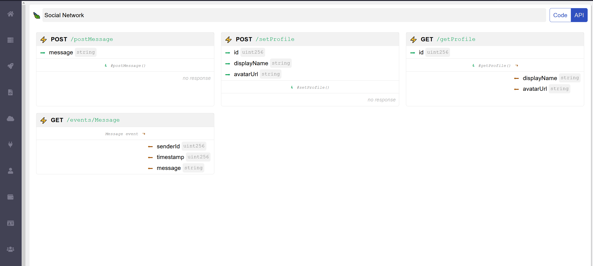
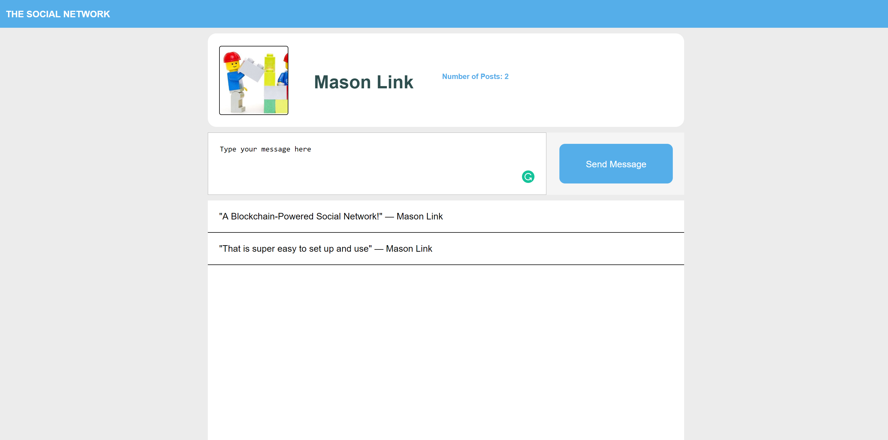

# Blockchain Powered Social Network

Blockmason is excited to launch our second blockchain product called [Link](https://mason.link). Link allows developers to use smart contracts and the power of blockchain in their web or mobile applications with *very little to no prior blockchain experience.* Link creates classic, conventional, web-based APIs for any smart contract written on a programmable blockchain (e.g. Ethereum). 

In this activity, we will use Link to record and retrieve messages (in this example, for a social network like app) on the blockchain. 

With Link and its built-in private blockchain, there is no need to use common blockchain development tools such as Infura or acquire an underlying token such as ETH from an exchange to pay for gas fees - it just works!

A simple front-end template is provided and [Parcel](https://parceljs.org/) will be used as the web application bundler and server.

The key steps of this activity are:
1. Setup project and install dependencies
2. Deploy a basic Social Network smart contract to the blockchain using Link
3. Configure a front-end JavaScript file
4. Run your decentralized Social Network application

### Setup

You will need to setup the following for this activity:

> Install `Node` and `npm`: https://nodejs.org/en/download/ (note - you can also use `yarn`)

> Clone the Github repo: https://github.com/blockmason/social-network-demo into a new folder.

> In the new folder, run `npm install` which will install the following key dependencies:

* `@blockmason/link-sdk` - https://www.npmjs.com/package/@blockmason/link-sdk - a simple SDK for interacting with the Link project.

* `parcel-bundler` - https://parceljs.org/getting_started.html - for bundling and running the web application

> Create a .env file in the project folder

> Create a Blockmason Link account - register at https://mason.link/sign-up and then setup your demo organization.

### Deploy the Social Network Smart Contract
The `Social-Network.sol` file contains a very simple Smart Contract:
```
pragma solidity ^0.5.8;

contract SocialNetwork {
  struct Profile {
    uint256 id;
    string displayName;
    string avatarUrl;
  }

  mapping (address => Profile) private addressToProfile;
  mapping (uint256 => address) private profileIdToAddress;

  event Message(uint256 senderId, uint256 timestamp, string message);

  function postMessage(string memory message) public {
    emit Message(addressToProfile[msg.sender].id, block.timestamp, message);
  }

  function setProfile(uint256 id, string memory displayName, string memory avatarUrl) public {
    require(profileIdToAddress[id] == address(0));
    profileIdToAddress[id] = msg.sender;
    addressToProfile[msg.sender].id = id;
    addressToProfile[msg.sender].displayName = displayName;
    addressToProfile[msg.sender].avatarUrl = avatarUrl;
  }

  function getProfile(uint256 id) public view returns (string memory displayName, string memory avatarUrl) {
    return (addressToProfile[profileIdToAddress[id]].displayName, addressToProfile[profileIdToAddress[id]].avatarUrl);
  }
}
```

> Sign into your Link account and copy and paste the `Social-Network.sol` contract code into the Link IDE. We'll call this project `Social-Network`. 



> Now click on the `API` button on the `Code/API` toggle and you will see API endpoints for all the Social Network smart contract functions and attributes!



**That's it!** Our Social Network smart contract is automatically deployed to the Link private blockchain and we are ready to use our web API endpoints in our front-end DApp. 

### Configure DApp Front-End

> Take a look at `index.html` and `index.js` code templates, which is where we will focus our efforts.

#### index.html
We see that the html template has a basic layout with a text area that will be used to submit messages on this profile page. It also has a feed that will display those messages.

#### index.js
The template code has been provided and we just need to fill in the details by adding in our clinetID and clientSecret to a .env file.
```
//Requirements
require('dotenv').config();
const { link } = require('@blockmason/link-sdk');
const fetch = require('node-fetch');
const project = link({
    clientId: process.env.CLIENT_ID,
    clientSecret: process.env.CLIENT_SECRET
}, {
    fetch
});
```
We import the `@blockmason/link-sdk` package. We then need to provide the `clientId` and `clientSecret` from Link in order to use the `.get` and `.post` methods provided by the `link` object. 

> Copy and paste your specific `clientId` and `clientSecret` from the bottom of the Link IDE screen:

> In the .env file add ```CLIENT_ID="<YOUR-CLIENT_ID>" CLIENT_SECRET="<YOUR-CLIENT-SECRET>"```


```
    // Get All Messages
    async function getMessages() {
        let allMessages = await project.get('/events/Message');

        return allMessages;
    }

    // Post a Message
    async function postMessage(newMessage) {

        await project.post('/postMessage', { message: newMessage });

    }
```
The above code:
* Loads all the messages from the blockchain

* Submits a message to the blockchain 
```
    // Get The Profile Data Based on ID
    async function getProfile(userID) {

        let profileData = await project.get('/getProfile', {
                "id": userID
            });

        return profileData;
    }

    // Set Profile Data Based on ID
    async function setProfile(idOfProfile) {
        // Set some profile settings for the demo
        let profilePost = {
            "id": idOfProfile,
            "displayName": "Mason Link",
            "avatarUrl": 'https://blockmason.link/wp-content/uploads/2019/04/download.jpg'
        }

        await project.post('/setProfile', profilePost);
    }
```
Here, we will call the `GET /getProfile` API endpoint to retrieve the profile data, and 'POST /setProfile' to set the profile image and name. 

> Find the complete code in `index.js`. 

Note - we didn't use any complex or large libraries like `web3.js`, which requires an instance of the `SocialNetwork` contract to be created before the contract function methods can be called. **Except for our confirm message, there is nothing in the code to even indicate that blockchains are involved!**

### Run your DApp

> Run the application from the project root folder with:
```
npm start
```
See the full command this executes under `scripts` in `package.json`. 

> Run the ```setProfile()``` function once to set the url and profile name (running more than once will result in an error ```{"errors":[{"detail":"Authentication failed"}],"jsonapi":"1.0","meta":{"name":"@blockmason/link-api","version":"1.16.1"}}```)

Note the following:
* By default, the DApp will run at https://localhost:1234 . You can specify the `-p` flag in the scripts command in `package.json` if you want to use a specific port.

* `Parcel` will create the following folders in your project folder: `.cache/` and `dist/`. If you run into any errors while running your DApp, delete these folders and run `npm start` again.

Copy and paste in an Ethereum wallet address (for example `0xca14563Ce2585B6026b7691f264ac2173CdEC530`) and try to own one of the Collectible Stamps. *Note:* if you do not enter in a valid address, you will see the following error alert pop up:


When running, your DApp should look similar to the following:



**Congrats** on getting your first DApp running from scratch using Link!

---

Throughout this example, we touched on Link concepts including deploying a smart contract, using the Link IDE, using Link API endpoints, and more.

To learn more about Blockmason Link, check out the official Link website at [blockmason.link](blockmason.link) or our weekly blog posts at [blockmason.link/blog](blockmason.link/blog).

## You can also connect with the Blockmason Link Team on these social channels:

-    Twitter: [https://twitter.com/BlockmasonLink](https://twitter.com/BlockmasonLink)
-    Telegram: [https://t.me/blockmasonlink](https://t.me/blockmasonlink)
-    Reddit: [https://www.reddit.com/r/blockmason/](https://www.reddit.com/r/blockmason/)
